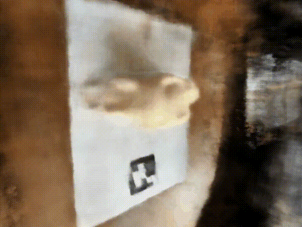

# Neural Radiance Fields (NeRF) 

This project implements **Neural Radiance Fields (NeRF)** for novel view synthesis as part of **CS180: Computer Vision and Computational Photography**. The system learns a continuous 3D scene representation from posed 2D images and renders photorealistic views from new camera positions.

---
